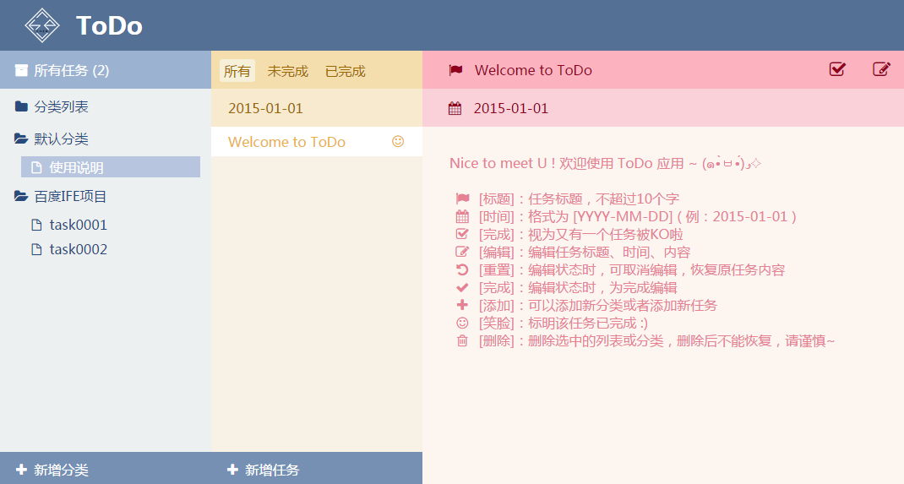
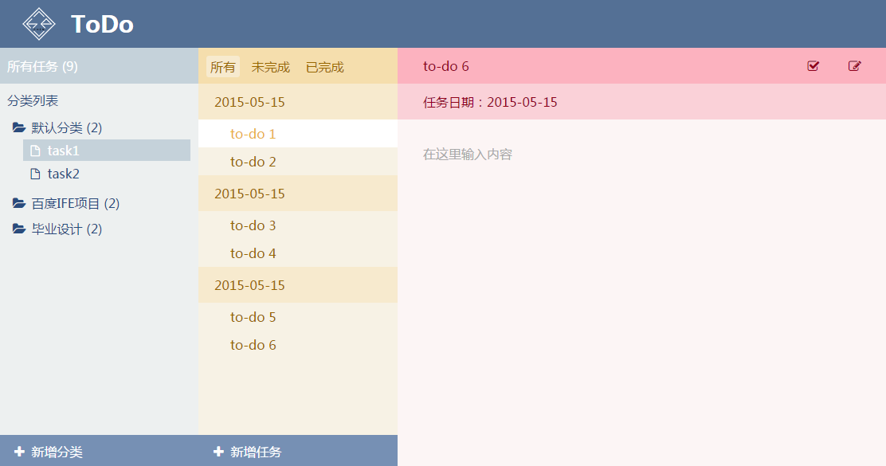
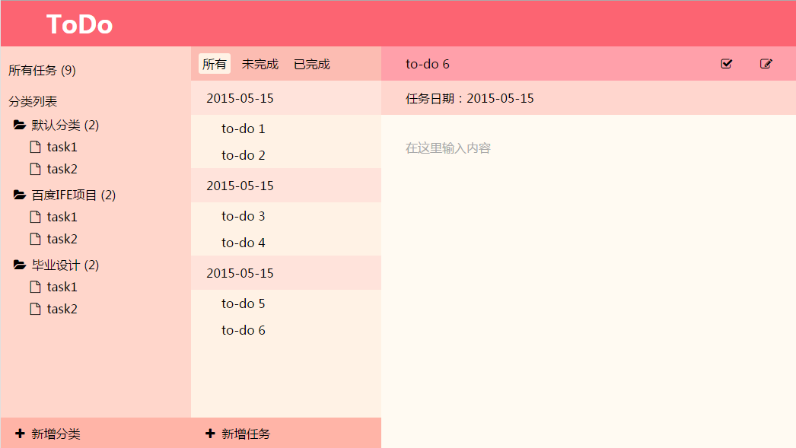

##baidu-ife task0003

- [[任务地址]](https://github.com/baidu-ife/ife/tree/master/task/task0003)
- [[查看代码]](https://github.com/zchen9/baidu-ife-task/tree/gh-pages/task0003/zchen9)
- [[查看demo]](http://www.chen9.info/baidu-ife-task/task0003/zchen9/)

###任务进程

05.23

本地存储还有IE8的布局兼容没有解决，已经奋战好几天了，决定放个假，多啃几本书再回头重构应用~就酱~

05.22 

大体设计出炉~

05.19 

更改主题，完成默认数据的显示

05.17 

完成基本界面设计demo

